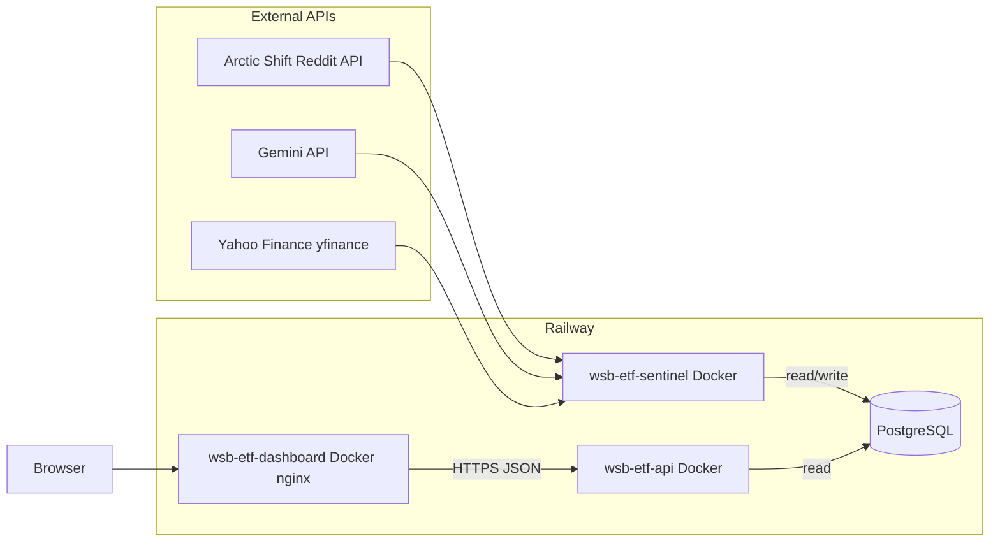

# WSB ETF

A synthetic “ETF” derived from [r/wallstreetbets](https://www.reddit.com/r/wallstreetbets/) discussion: Reddit posts are scraped, sentiment is labeled with **Google Gemini**, weights and a daily NAV-style price are computed (using **Yahoo Finance** via `yfinance`), and results are stored in **PostgreSQL**. A small **Express** API exposes that data to a **Vite + React** dashboard with charting (**TradingView Lightweight Charts**).

This repo is set up so each piece can run in **Docker** and deploy cleanly on **[Railway](https://railway.app/)** as separate services that share one database.

---

## How the services connect



| Component | Role |
|-----------|------|
| **wsb-etf-sentinel** (`wsb-etf-sentinel/`) | Scheduled job: fetch top posts from WSB (via Arctic Shift), analyze tickers with Gemini, compute portfolio weights and a weighted ETF price, diff vs yesterday, **write** to Postgres. |
| **wsb-etf-db** (PostgreSQL) | Single source of truth: composition, daily price points, and changelog rows. Created/updated by the sentinel; **read** by the API. |
| **wsb-etf-api** (`wsb-etf-api/`) | Express app on `PORT` (default 3000): JSON endpoints under `/api/*`, CORS enabled for browser calls from the dashboard origin. |
| **wsb-etf-dashboard** (`wsb-etf-dashboard/`) | Static SPA built with Vite, served by nginx. At build time, `VITE_API_URL` is baked in so the browser calls your deployed API directly (not through nginx). |

**Data flow (daily):**

1. **Scrape** — Top posts from r/wallstreetbets; tickers extracted from titles/bodies (Arctic Shift).
2. **Analyze** — Gemini returns per-ticker sentiment (`bullish` / `bearish` / `neutral`).
3. **Compose** — Bullish-heavy names get higher weight; weights normalize to 100% of the synthetic basket.
4. **Price** — `yfinance` pulls current (or latest) prices; a weighted sum becomes the day’s ETF price.
5. **Changelog** — Compare today’s basket to yesterday’s → `added`, `removed`, `rebalanced`.
6. **Persist** — All of the above is upserted into Postgres.
7. **Serve** — The API reads those tables; the UI fetches JSON and renders tables + price chart.

**Presync / custom window:** Arctic Shift returns posts ordered by time, not by score. The pipeline paginates (up to `max_posts_scan`, default 800), keeps posts that mention tickers, then **sorts by Reddit score** and analyzes the top `limit` (default 50). Use a time window so “last year” is meaningful, for example:

- **CLI** (from `wsb-etf-sentinel/`, with `DATABASE_URL` and `GEMINI_API_KEY` set):

  `python -m src.main --after 1year --limit 50 --max-posts-scan 1200`

  Optional: `--date 2026-04-03` tags the ETF row in Postgres; `--compare-date` sets the changelog baseline.

- **HTTP:** Run `python -m src.sync_server` with `SYNC_HTTP_PORT=8080`, then `POST /sync` with JSON such as `{ "after": "1year", "limit": 50, "maxPostsScan": 1200 }`. Point the API’s `PIPELINE_SYNC_URL` at that service and call `POST /api/sync` with the same body (and `SYNC_SECRET` if configured).

---

## Database schema

The pipeline ensures these tables exist (see `wsb-etf-sentinel/src/db.py`):

| Table | Purpose |
|-------|---------|
| `etf_composition` | `ticker`, `percentage`, `date` — **UNIQUE (`date`, `ticker`)** |
| `etf_data_points` | `price`, `date` — one row per day (`date` unique) |
| `etf_changelog` | `action` (`added` / `removed` / `rebalanced`), `ticker`, `weight`, `date` |

The API queries these same tables (no separate migrations in `wsb-etf-api/`).

---

## API surface

Base URL is your Railway API service URL (or `http://localhost:3000` locally).

| Method | Path | Description |
|--------|------|-------------|
| GET | `/api/health` | Liveness + DB connectivity |
| GET | `/api/composition` | Current basket (optional `?date=YYYY-MM-DD`) |
| GET | `/api/price-history` | ETF price series (optional `from` / `to`) |
| GET | `/api/changelog` | Recent composition changes |
| POST | `/api/sync` | Proxies to the pipeline HTTP sync service when `PIPELINE_SYNC_URL` is set (see below) |

---

## Environment variables

### wsb-etf-sentinel (`wsb-etf-sentinel/`)

| Variable | Required | Description |
|----------|----------|-------------|
| `DATABASE_URL` | Yes | Postgres connection string (Railway provides this when you link Postgres) |
| `GEMINI_API_KEY` | Yes | Google AI / Gemini API key |
| `SYNC_HTTP_PORT` | No | If set (e.g. `8080`), run `python -m src.sync_server` instead of the one-shot job to expose `POST /sync` for on-demand runs |
| `SYNC_SECRET` | No | Shared bearer token; required on `POST /sync` when set |

### wsb-etf-api (`wsb-etf-api/`)

| Variable | Required | Description |
|----------|----------|-------------|
| `DATABASE_URL` | Yes | Same database as the pipeline |
| `PORT` | No | Listen port (Railway sets this automatically) |
| `PIPELINE_SYNC_URL` | No | Base URL of the pipeline sync server (e.g. `https://your-pipeline-sync.up.railway.app` or internal `http://…:8080`). Enables `POST /api/sync`. |
| `SYNC_SECRET` | No | If set, callers must send `Authorization: Bearer <secret>` (or `X-Sync-Secret`) to `POST /api/sync`, and the API forwards it to the pipeline. |
| `SYNC_TIMEOUT_MS` | No | Upstream sync timeout (default 300000 ms). |

The API enables SSL for Postgres when `DATABASE_URL` contains `railway` (managed TLS to Railway Postgres).

### wsb-etf-dashboard (`wsb-etf-dashboard/`)

| Variable | When | Description |
|----------|------|-------------|
| `VITE_API_URL` | **Build time** | Public base URL of the API (e.g. `https://your-api.up.railway.app`) — no trailing path |

Copy `wsb-etf-dashboard/.env.example` and `wsb-etf-sentinel/.env.example` as starting points for local development.

---

## Local development (quick)

- **Postgres**: Run locally or use a cloud instance; set `DATABASE_URL` for both pipeline and API.
- **API**: `cd wsb-etf-api && npm ci && npx tsx src/index.ts`
- **Dashboard**: `cd wsb-etf-dashboard && npm ci` — create `.env` with `VITE_API_URL=http://localhost:3000` — `npm run dev`
- **Sentinel**: `cd wsb-etf-sentinel` — install deps from `requirements.txt` or use `pyproject.toml` — set env vars — `python -m src.main`

Docker builds: `wsb-etf-api/Dockerfile`, `wsb-etf-dashboard/Dockerfile`, `wsb-etf-sentinel/Dockerfile` each target their respective directories as the build context.

---

## Deploying on Railway

Typical layout:

1. **Create wsb-etf-db** — Railway Postgres plugin; note the `DATABASE_URL` (or use Railway’s variable reference when linking services).
2. **Service: wsb-etf-api** — Root directory `wsb-etf-api/`, Dockerfile deploy. Attach the same `DATABASE_URL` as Postgres. Railway injects `PORT`.
3. **Service: wsb-etf-sentinel** — Root directory `wsb-etf-sentinel/`, Dockerfile deploy. Same `DATABASE_URL`, plus `GEMINI_API_KEY`. Run on a **cron** schedule (e.g. daily) or trigger manually; this is a batch job, not a long-running server.
4. **Service: wsb-etf-dashboard** — Root directory `wsb-etf-dashboard/`, Dockerfile deploy. Set **build argument** `VITE_API_URL` to your **public API URL** (the `https://…` Railway gives the API service) so the browser can reach the API across origins (CORS is already enabled on the API).

After the first pipeline run, the API health check and UI should show data once `etf_*` tables are populated.

---

## Repository layout

```
wsb-etf-api/        Express + TypeScript API
wsb-etf-dashboard/  Vite + React UI (nginx in production image)
wsb-etf-sentinel/   Python ingestion + Gemini + yfinance + DB writes
```

Together, these implement the architecture: **external data → pipeline → Postgres → API → browser**, with **Yahoo-backed pricing inside the pipeline** and **charting in the frontend** driven by your own ETF history API.
