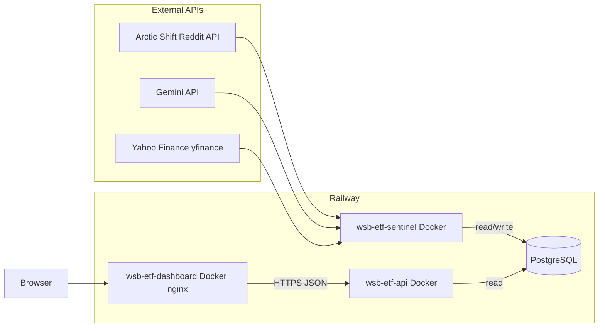
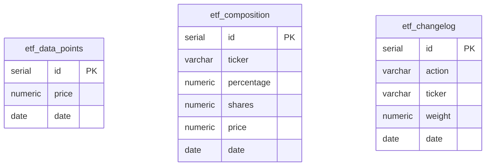

# WSB ETF

A synthetic “ETF” derived from [r/wallstreetbets](https://www.reddit.com/r/wallstreetbets/) discussion: Reddit posts are pulled via the **Arctic Shift** API; **`gemini-3.1-flash-lite-preview`** returns a **JSON array** constrained by an explicit **response schema** (`application/json`); results are merged per ticker with **Reddit score–weighted** sentiment votes, then weights and a **NAV-style** price are computed (using **Yahoo Finance** via `yfinance`), and results are stored in **PostgreSQL**. The pipeline is meant to run on a **weekly** cadence (for example Railway cron): each run looks at **about the last seven days** of discussion, then **fully rebalances**—the model **liquidates the entire prior basket** at as-of closes and **repurchases** the new target weights with the proceeds. A small **Express** API exposes that data to a **Vite + React** dashboard with charting (**TradingView Lightweight Charts**).

This repo is set up so each piece can run in **Docker** and deploy cleanly on **[Railway](https://railway.app/)** as separate services that share one database.

---

## How the services connect



| Component                                    | Role                                                                                                                                                                                                                                                                                                                                                                                                                                                                                                                                                                                                                                                                                                                                                                                                                                                                                                                                                                                                                                                                                                                                                                                                                                                                                                                                                                                                                                                                                                                      |
| -------------------------------------------- | ------------------------------------------------------------------------------------------------------------------------------------------------------------------------------------------------------------------------------------------------------------------------------------------------------------------------------------------------------------------------------------------------------------------------------------------------------------------------------------------------------------------------------------------------------------------------------------------------------------------------------------------------------------------------------------------------------------------------------------------------------------------------------------------------------------------------------------------------------------------------------------------------------------------------------------------------------------------------------------------------------------------------------------------------------------------------------------------------------------------------------------------------------------------------------------------------------------------------------------------------------------------------------------------------------------------------------------------------------------------------------------------------------------------------------------------------------------------------------------------------------------------------- |
| **wsb-etf-sentinel** (`wsb-etf-sentinel/`)   | Batch pipeline: on startup, **`ensure_tables()`** in `db.py` creates `etf_*` tables if needed and **`ensure_initial_baseline()`** seeds a genesis row when the DB is empty (see **Initial database seed** below). It pulls r/wallstreetbets from [Arctic Shift](https://github.com/ArthurHeitmann/arctic_shift/blob/master/api/README.md) over a configurable window (default **7 calendar days** ending on the ETF date, aligned with a **weekly** rebalance story), **drops** posts with no usable selftext (`[removed]` / `[deleted]` / empty), keeps posts with **archived `score` ≥ 10** (`min_score` in `scraper.py`), **re-ranks by `score`**, and takes the top _N_. **One Gemini call per post** with structured JSON (`RESPONSE_SCHEMA` in `analyzer.py`); signals are **merged per ticker** with **score-weighted** sentiment votes. **`calculator.rebalance`** implements a **full turnover** rebalance: **sell every existing line** at as-of prices (shares × close → **NAV**), then **buy** the new target basket with that cash so each `etf_composition` row stores **`percentage`**, **`shares`**, and per-ticker **`price`**. Changelog rows summarize diffs vs. `--compare-date` (default **one week** before the run date). Results are **inserted** into Postgres (`insert_composition`, `insert_etf_price`, `insert_changelog`). The shipped **`Dockerfile`** runs **`python -m src.main`** once (schedule with **weekly** cron or run manually); there is no bundled HTTP server in this package. |
| **wsb-etf-db** (PostgreSQL)                  | Single source of truth: composition (with holdings detail), daily NAV points, and changelog. **Written** by the sentinel; **read** by the API.                                                                                                                                                                                                                                                                                                                                                                                                                                                                                                                                                                                                                                                                                                                                                                                                                                                                                                                                                                                                                                                                                                                                                                                                                                                                                                                                                                            |
| **wsb-etf-api** (`wsb-etf-api/`)             | Express app on `PORT` (default 3000): JSON endpoints under `/api/*`, CORS enabled for browser calls from the dashboard origin.                                                                                                                                                                                                                                                                                                                                                                                                                                                                                                                                                                                                                                                                                                                                                                                                                                                                                                                                                                                                                                                                                                                                                                                                                                                                                                                                                                                            |
| **wsb-etf-dashboard** (`wsb-etf-dashboard/`) | Static SPA built with Vite, served by nginx. At build time, `VITE_API_URL` is baked in so the browser calls your deployed API directly (not through nginx).                                                                                                                                                                                                                                                                                                                                                                                                                                                                                                                                                                                                                                                                                                                                                                                                                                                                                                                                                                                                                                                                                                                                                                                                                                                                                                                                                               |

**Data flow (each run — typically weekly):**

1. **Fetch** — Arctic Shift returns r/wallstreetbets posts (paginated, `sort` = `created_utc`). The pipeline dedupes pages, **discards** rows with no real selftext (**empty**, **`[removed]`**, or **`[deleted]`**), keeps only posts with **`score` ≥ 10**, scans up to **`max_posts_scan`** (default **15000**, but see **pagination cap** below), **sorts by `score`**, and keeps the top **`limit`** (default **150**) for Gemini.
2. **Analyze** — For **each** retained post, **`gemini-3.1-flash-lite-preview`** runs with **`response_mime_type: application/json`** and a **JSON Schema** that requires a top-level **array** of objects: **`ticker`** (string) and **`sentiment`** (`bullish` \| `bearish` \| `neutral`). The model sees **title + up to 2000 characters** of body (see `PROMPT_TEMPLATE` in `analyzer.py`). **`generate_content` → `json.loads(response.text)`** yields that array (empty if no tickers). Per-post signals are then **aggregated per ticker**: for each `(ticker, sentiment)` vote, the **post’s Reddit `score`** is added to that sentiment’s running total; the winning label is whichever **`bullish` / `bearish` / `neutral`** has the **largest summed score** (see `_merge_sentiments`).
3. **Compose** — In `calculator.compute_composition`, sentiment maps to weights (**bullish** = 1.0, **neutral** = 0.3, **bearish** = 0), each ticker’s score is multiplied by that factor and summed; names below **1%** of the basket are dropped and their weight redistributed across survivors. Weights sum to 100% of the target basket.
4. **Rebalance / NAV** — `calculator.rebalance` uses `yfinance` for **as-of closes** (historical when `--date` is in the past). Conceptually: **liquidate 100% of the old portfolio** (each old holding: shares × that day’s close), sum to **NAV**, then **repurchase** the new basket at the **new** weights using that **entire** NAV—**sell everything, then buy the new allocation**. Each saved row gets **shares** and **price** in `etf_composition`. If there is no prior composition, NAV falls back to the latest `etf_data_points` row or the genesis **$1000** baseline (see seeding below).
5. **Changelog** — `calculator.diff_composition` compares the new basket to the composition on **`--compare-date`** (default **one week before** the ETF date) → `added`, `removed`, `rebalanced`.
6. **Persist** — New rows are **inserted** for that run date into `etf_composition`, `etf_data_points` (NAV), and `etf_changelog`.
7. **Serve** — The API reads those tables; the UI fetches JSON and renders tables + price chart.

**Scores:** Arctic Shift’s [API notes](https://github.com/ArthurHeitmann/arctic_shift/blob/master/api/README.md) state that until **`score` / `num_comments` are refreshed (~36 hours)** they may be **1 or 0** right after first archive—so “top by score” follows the **archive**, not always live Reddit. The scraper’s **`min_score` = 10** filters out most of those placeholder rows, but very new high‑engagement threads can still be missing from the ranking until the archive updates. Optional field **`retrieved_on`** is available from their API if you extend `fields` in `scraper.py`.

**Gemini structured output** (`wsb-etf-sentinel/src/analyzer.py`):

The model is configured with `GenerationConfig(response_mime_type="application/json", response_schema=…)` so the API returns **valid JSON** matching this shape (same idea as Gemini “structured output” / JSON schema mode):

| Schema (conceptual) |                                                                             |
| ------------------- | --------------------------------------------------------------------------- |
| Root                | **Array** of objects                                                        |
| Each item           | **`ticker`**: string (US symbol, e.g. `TSLA`)                               |
|                     | **`sentiment`**: exactly one of **`bullish`**, **`bearish`**, **`neutral`** |

Example model response (one post that mentions two names):

```json
[
  { "ticker": "TSLA", "sentiment": "bullish" },
  { "ticker": "NVDA", "sentiment": "neutral" }
]
```

No tickers in the post → **`[]`**. After all posts are processed, duplicate tickers across posts are collapsed to **one sentiment per ticker** by **summing post scores per sentiment** and taking the **max** before `calculator.compute_composition` runs.

**Pipeline defaults (`wsb-etf-sentinel`):**

- **Timezone:** ETF **`--date`** and the default “today” when `--date` is omitted use **`America/New_York`** (handles EST/EDT).
- **`--date`:** Calendar date written to Postgres for composition / price / changelog. Default: **today in Eastern**.
- **`--after` / `--before`:** Passed to Arctic Shift (see their docs: ISO dates, epoch, or relative values like `2d`, `1year`). If **both** are omitted, the window is **`(ETF date − 7 days)` → `ETF date`** as `YYYY-MM-DD` (seven **calendar** days leading up to and not including the end boundary semantics their API applies to `before`).
- **`--compare-date`:** Changelog baseline composition date. Default: **7 calendar days before** the ETF date.
- **`--limit`:** How many highest‑`score` posts to send to Gemini after filters (default **150**).
- **`--max-posts-scan`:** Target max **eligible** posts to collect before sorting (default **15000**). **`scraper.fetch_top_posts_by_score`** uses **`max_pages` = 25** (up to **100** posts per Arctic Shift page), so each run **fetches at most ~2,500 raw posts** from the API unless you raise `max_pages` in code—only then can a higher `max_posts_scan` matter.
- **`min_score`:** Hardcoded **10** in `fetch_top_posts_by_score` (not a CLI flag)—posts below that **archived** score are dropped after the body filter.

**Backfill example (CLI)** — explicit window and caps:

```bash
cd wsb-etf-sentinel
python -m src.main --date 2026-04-08 --after 2026-03-01 --before 2026-04-08 --limit 150 --max-posts-scan 15000
```

---

## Database schema

The pipeline runs **`CREATE TABLE IF NOT EXISTS …`** and baseline seeding via `wsb-etf-sentinel/src/db.py` (no separate migration runner).

### Initial database seed

On first use (no rows for the genesis date), **`ensure_initial_baseline()`** inserts:

- **`etf_composition`** — **100%** **`VOO`** on **`2025-12-29`**, with **`shares`** derived from **`INITIAL_ETF_PRICE` ($1000)** ÷ **`INITIAL_VOO_PRICE` ($632.60)**, **`price`** = VOO close used for that math.
- **`etf_changelog`** — one **`added`** row for **`VOO`** at full weight on the same date.
- **`etf_data_points`** — ETF NAV **$1000** on that date.

Constants live at the top of `db.py` (`INITIAL_COMPOSITION_DATE`, `INITIAL_COMPOSITION_TICKER`, etc.). The first “real” pipeline run after seed then **rebalances** from that basket using live prices for `--date`.

### Tables



**Constraints (not drawn as edges):** `etf_composition` has **`UNIQUE (date, ticker)`**. `etf_data_points` has **`UNIQUE (date)`** — one NAV per business **`date`**. `etf_changelog.action` values are **`added`**, **`removed`**, **`rebalanced`**. Rows across tables line up on the same **`date`** (one pipeline run); there are no foreign keys.

| Table             | Columns (relevant)                                        | Notes                                                                                                                                   |
| ----------------- | --------------------------------------------------------- | --------------------------------------------------------------------------------------------------------------------------------------- |
| `etf_composition` | `ticker`, `percentage`, **`shares`**, **`price`**, `date` | **UNIQUE (`date`, `ticker`)**. **`price`** is the **constituent** close used for that rebalance; ETF-level NAV is in `etf_data_points`. |
| `etf_data_points` | `price`, `date`                                           | Synthetic ETF **NAV** for `date` (`date` unique).                                                                                       |
| `etf_changelog`   | `action`, `ticker`, `weight`, `date`                      | Human-readable diff vs. compare baseline.                                                                                               |

The API reads the same tables (`wsb-etf-api` composition routes currently expose **`ticker`** and **`percentage`** only; **`shares`** / **`price`** are available for future use or ad hoc SQL).

---

## API surface

Base URL is your Railway API service URL (or `http://localhost:3000` locally).

| Method | Path                 | Description                                  |
| ------ | -------------------- | -------------------------------------------- |
| GET    | `/api/health`        | Liveness + DB connectivity                   |
| GET    | `/api/composition`   | Current basket (optional `?date=YYYY-MM-DD`) |
| GET    | `/api/price-history` | ETF price series (optional `from` / `to`)    |
| GET    | `/api/changelog`     | Recent composition changes                   |

---

## Environment variables

### wsb-etf-sentinel (`wsb-etf-sentinel/`)

| Variable         | Required | Description                                                               |
| ---------------- | -------- | ------------------------------------------------------------------------- |
| `DATABASE_URL`   | Yes      | Postgres connection string (Railway provides this when you link Postgres) |
| `GEMINI_API_KEY` | Yes      | Google AI / Gemini API key                                                |

### wsb-etf-api (`wsb-etf-api/`)

| Variable       | Required | Description                                   |
| -------------- | -------- | --------------------------------------------- |
| `DATABASE_URL` | Yes      | Same database as the pipeline                 |
| `PORT`         | No       | Listen port (Railway sets this automatically) |

The API enables SSL for Postgres when `DATABASE_URL` contains `railway` (managed TLS to Railway Postgres).

### wsb-etf-dashboard (`wsb-etf-dashboard/`)

| Variable       | When           | Description                                                                            |
| -------------- | -------------- | -------------------------------------------------------------------------------------- |
| `VITE_API_URL` | **Build time** | Public base URL of the API (e.g. `https://your-api.up.railway.app`) — no trailing path |

Copy `wsb-etf-dashboard/.env.example` and `wsb-etf-sentinel/.env.example` as starting points for local development.

---

## Local development (quick)

- **Postgres**: Run locally or use a cloud instance; set `DATABASE_URL` for both pipeline and API.
- **API**: `cd wsb-etf-api && npm ci && npx tsx src/index.ts`
- **Dashboard**: `cd wsb-etf-dashboard && npm ci` — create `.env` with `VITE_API_URL=http://localhost:3000` — `npm run dev`
- **Sentinel**: `cd wsb-etf-sentinel` — install deps from `requirements.txt` or use `pyproject.toml` — set env vars — `python -m src.main`

Docker builds: `wsb-etf-api/Dockerfile`, `wsb-etf-dashboard/Dockerfile`, `wsb-etf-sentinel/Dockerfile` each target their respective directories as the build context.

---

## Deploying on Railway

Typical layout:

1. **Create wsb-etf-db** — Railway Postgres plugin; note the `DATABASE_URL` (or use Railway’s variable reference when linking services).
2. **Service: wsb-etf-api** — Root directory `wsb-etf-api/`, Dockerfile deploy. Attach the same `DATABASE_URL` as Postgres. Railway injects `PORT`.
3. **Service: wsb-etf-sentinel** — Root directory `wsb-etf-sentinel/`, Dockerfile deploy. Same `DATABASE_URL`, plus `GEMINI_API_KEY`. Schedule **weekly** (or whatever cadence you want) with Railway **cron**, or trigger manually; this is a batch job, not a long-running server. Defaults (**7-day** post window, **`--compare-date`** one week back) match a **weekly** rebalance rhythm.
4. **Service: wsb-etf-dashboard** — Root directory `wsb-etf-dashboard/`, Dockerfile deploy. Set **build argument** `VITE_API_URL` to your **public API URL** (the `https://…` Railway gives the API service) so the browser can reach the API across origins (CORS is already enabled on the API).

After the first pipeline run, the API health check and UI should show data once `etf_*` tables are populated.

---

## Repository layout

```
wsb-etf-api/        Express + TypeScript API
wsb-etf-dashboard/  Vite + React UI (nginx in production image)
wsb-etf-sentinel/   Python ingestion + Gemini + yfinance + DB writes
```

Together, these implement the architecture: **external data → pipeline → Postgres → API → browser**, with **Yahoo-backed pricing inside the pipeline** and **charting in the frontend** driven by your own ETF history API.
