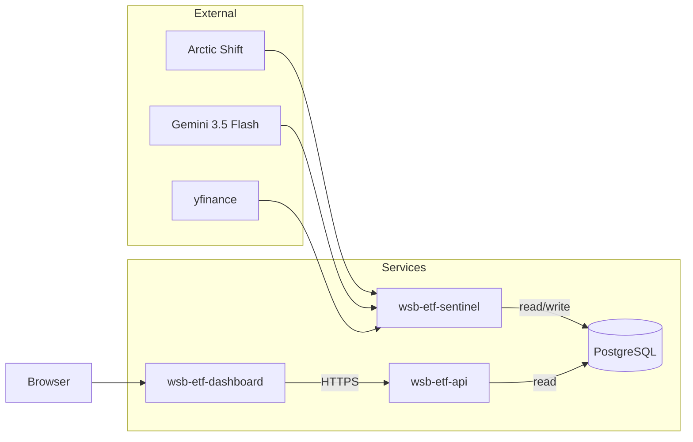

# WSB ETF

Synthetic ETFs from Reddit discussion: Arctic Shift → **Gemini 3.5 Flash** (structured JSON) → Reddit score–weighted sentiment → basket weights and NAV (yfinance) → PostgreSQL. Weekly-style rebalance: full liquidation then repurchase at new weights. **Vite + React** dashboard with a subreddit toggle, backed by a JSON **API**. Services run in **Docker** with a shared database.

Each subreddit gets its own ETF track (composition, NAV, changelog) keyed by `subreddit` in Postgres. Cron defaults to **r/wallstreetbets** only; set `SUBREDDITS` to run more.

## Subreddits

| ID | Label |
| --- | --- |
| `wallstreetbets` | WSB |
| `investing` | Investing |
| `smallstreetbets` | SmallStreetBets |
| `stocks` | Stocks |
| `stockmarket` | Stock Market |
| `bogleheads` | Bogleheads |

Allowlists live in `wsb-etf-api/src/subreddits.ts` and `wsb-etf-dashboard/src/lib/subreddits.ts`. New subs need a historical **backfill** before the dashboard shows a full chart.

## Architecture



| Package | Role |
| ------- | ---- |
| **wsb-etf-sentinel** | **Two cron jobs** on the same image: (1) `python -m src.main` — full pipeline (Reddit → Gemini → rebalance → DB). (2) `python -m src.nav_tracker` — daily NAV only (prices current composition, upserts `etf_data_points`; no scrape or rebalance). Both accept `--subreddit`; without `SUBREDDITS` env, only WSB runs. |
| **wsb-etf-db** | Postgres: composition, NAV, changelog — all scoped by `subreddit`. |
| **wsb-etf-api** | JSON under `/api/*`, CORS for the dashboard. Data routes take `?subreddit=` (default `wallstreetbets`). |
| **wsb-etf-dashboard** | SPA with subreddit selector; `VITE_API_URL` baked in at build. |

## Database

Created in `wsb-etf-sentinel/src/db.py` (`ensure_tables`, baseline seed when empty). Tables: `etf_composition` (subreddit, ticker, %, shares, price, date), `etf_data_points` (subreddit, NAV per date), `etf_changelog` (subreddit, added / removed / rebalanced). Each subreddit gets an independent genesis row (100% VOO on 2025-12-29) via `ensure_initial_baseline`. Rebalance writes are idempotent (`replace_*` + upsert) so backfills can be rerun safely.

## API

| Method | Path | Notes |
| ------ | ---- | ----- |
| GET | `/api/health` | Liveness + DB |
| GET | `/api/subreddits` | Allowlisted subreddits |
| GET | `/api/composition` | `?subreddit=`; optional `?date=YYYY-MM-DD` |
| GET | `/api/price-history` | `?subreddit=`; optional `from` / `to` |
| GET | `/api/changelog` | `?subreddit=`; recent changes |

## Environment

**Sentinel:** `DATABASE_URL` (both jobs). `GEMINI_API_KEY` only for `src.main` (`nav_tracker` does not call Gemini). Optional `SUBREDDITS` — comma-separated list (e.g. `wallstreetbets,investing,bogleheads`); defaults to `wallstreetbets`.  
**API:** `DATABASE_URL`, optional `PORT`  
**Dashboard (build):** `VITE_API_URL` — public API base URL, no trailing path  

Use `.env.example` files in each package where present.

## Local dev

- Postgres + `DATABASE_URL` on sentinel and API.
- API: `cd wsb-etf-api && npm ci && npx tsx src/index.ts`
- Dashboard: `cd wsb-etf-dashboard && npm ci` — `.env` with `VITE_API_URL=http://localhost:3000` — `npm run dev`
- Sentinel: `cd wsb-etf-sentinel` — deps from `requirements.txt` / `pyproject.toml`
  - Single run: `python -m src.main --subreddit investing`
  - Daily NAV: `python -m src.nav_tracker --subreddit investing`
  - Historical backfill (mirrors WSB date grid): `python -m src.backfill --subreddit bogleheads --through 2026-05-21` — add `--skip-existing` to resume

## Deploy

1. Provision Postgres → `DATABASE_URL`.
2. **wsb-etf-api** — root `wsb-etf-api/`, Dockerfile, same `DATABASE_URL`.
3. **wsb-etf-sentinel** — root `wsb-etf-sentinel/`, Dockerfile, `DATABASE_URL` + `GEMINI_API_KEY`. **Two** cron triggers: **`python -m src.main`** (rebalance cadence) and **`python -m src.nav_tracker`** (e.g. daily NAV). Override the image `CMD` per trigger or run manually. Set `SUBREDDITS` on both if cron should cover every allowlisted sub.
4. **wsb-etf-dashboard** — root `wsb-etf-dashboard/`, Dockerfile, build arg `VITE_API_URL` = public API URL.

## Repo layout

```
wsb-etf-api/        TypeScript HTTP API
wsb-etf-dashboard/  Vite + React (nginx in prod image)
wsb-etf-sentinel/   Python pipeline + Gemini + yfinance
```
