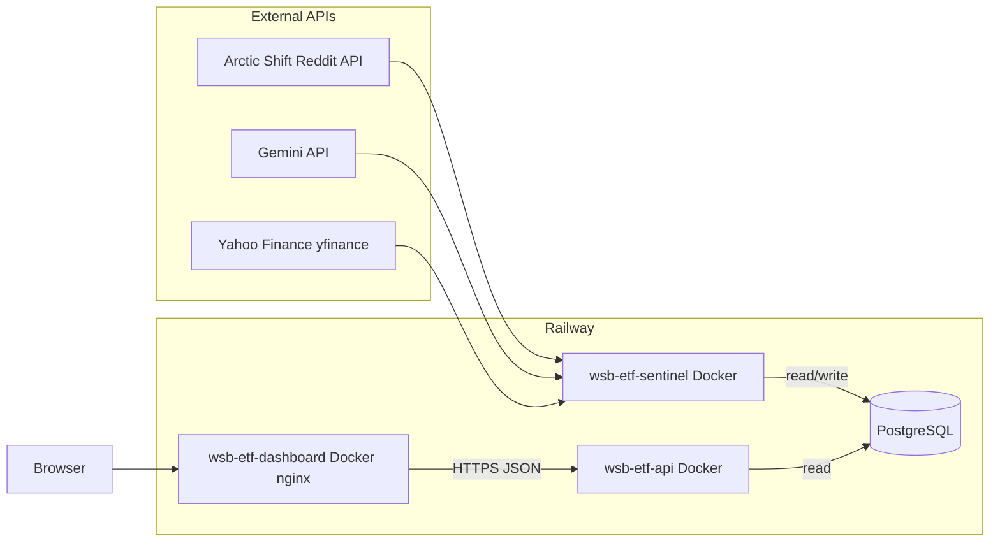
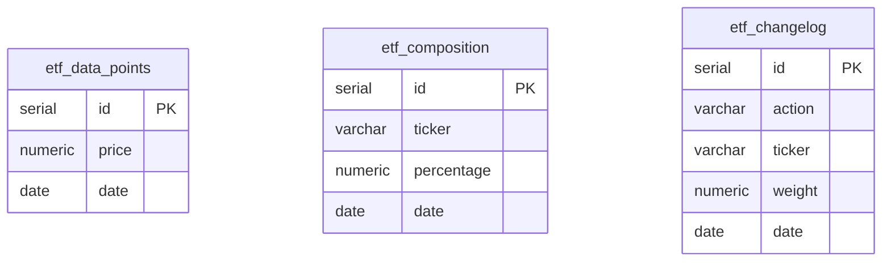

# WSB ETF

A synthetic “ETF” derived from [r/wallstreetbets](https://www.reddit.com/r/wallstreetbets/) discussion: Reddit posts are pulled via the **Arctic Shift** API; **Gemini 2.0 Flash** returns a **JSON array** constrained by an explicit **response schema** (`application/json`); results are merged per ticker with **Reddit score–weighted** sentiment votes, then weights and a daily NAV-style price are computed (using **Yahoo Finance** via `yfinance`), and results are stored in **PostgreSQL**. A small **Express** API exposes that data to a **Vite + React** dashboard with charting (**TradingView Lightweight Charts**).

This repo is set up so each piece can run in **Docker** and deploy cleanly on **[Railway](https://railway.app/)** as separate services that share one database.

---

## How the services connect



| Component | Role |
|-----------|------|
| **wsb-etf-sentinel** (`wsb-etf-sentinel/`) | Batch pipeline: pull r/wallstreetbets from [Arctic Shift](https://github.com/ArthurHeitmann/arctic_shift/blob/master/api/README.md) over a configurable time window (default **7 calendar days** ending on the ETF date), **drop** posts with no usable selftext (`[removed]` / `[deleted]` / empty), keep posts with **archived `score` ≥ 10** (`min_score` in `scraper.py`), **re-rank by `score`** and take the top *N*. **One Gemini call per post** with **structured JSON** output (`RESPONSE_SCHEMA` in `analyzer.py`); signals are **merged per ticker** using **score-weighted** sentiment votes, then composition / ETF price / changelog **write** to Postgres. Optional **Flask** sync server (`python -m src.sync_server` when `SYNC_HTTP_PORT` is set) exposes `POST /sync` for on-demand runs. |
| **wsb-etf-db** (PostgreSQL) | Single source of truth: composition, daily price points, and changelog rows. Created/updated by the sentinel; **read** by the API. |
| **wsb-etf-api** (`wsb-etf-api/`) | Express app on `PORT` (default 3000): JSON endpoints under `/api/*`, CORS enabled for browser calls from the dashboard origin. |
| **wsb-etf-dashboard** (`wsb-etf-dashboard/`) | Static SPA built with Vite, served by nginx. At build time, `VITE_API_URL` is baked in so the browser calls your deployed API directly (not through nginx). |

**Data flow (daily):**

1. **Fetch** — Arctic Shift returns r/wallstreetbets posts (paginated, `sort` = `created_utc`). The pipeline dedupes pages, **discards** rows with no real selftext (**empty**, **`[removed]`**, or **`[deleted]`**), keeps only posts with **`score` ≥ 10**, scans up to **`max_posts_scan`** (default **15000**, but see **pagination cap** below), **sorts by `score`**, and keeps the top **`limit`** (default **200**) for Gemini.
2. **Analyze** — For **each** retained post, **`gemini-2.0-flash`** runs with **`response_mime_type: application/json`** and a **JSON Schema** that requires a top-level **array** of objects: **`ticker`** (string) and **`sentiment`** (`bullish` \| `bearish` \| `neutral`). The model sees **title + up to 2000 characters** of body (see `PROMPT_TEMPLATE` in `analyzer.py`). **`generate_content` → `json.loads(response.text)`** yields that array (empty if no tickers). Per-post signals are then **aggregated per ticker**: for each `(ticker, sentiment)` vote, the **post’s Reddit `score`** is added to that sentiment’s running total; the winning label is whichever **`bullish` / `bearish` / `neutral`** has the **largest summed score** (see `_merge_sentiments`).
3. **Compose** — Bullish-heavy names get higher weight; weights normalize to 100% of the synthetic basket.
4. **Price** — `yfinance` pulls current (or latest) prices; a weighted sum becomes the day’s ETF price.
5. **Changelog** — The new basket is diffed against a baseline composition (by default **one week before** the ETF date) → `added`, `removed`, `rebalanced`.
6. **Persist** — All of the above is upserted into Postgres.
7. **Serve** — The API reads those tables; the UI fetches JSON and renders tables + price chart.

**Scores:** Arctic Shift’s [API notes](https://github.com/ArthurHeitmann/arctic_shift/blob/master/api/README.md) state that until **`score` / `num_comments` are refreshed (~36 hours)** they may be **1 or 0** right after first archive—so “top by score” follows the **archive**, not always live Reddit. The scraper’s **`min_score` = 10** filters out most of those placeholder rows, but very new high‑engagement threads can still be missing from the ranking until the archive updates. Optional field **`retrieved_on`** is available from their API if you extend `fields` in `scraper.py`.

**Gemini structured output** (`wsb-etf-sentinel/src/analyzer.py`):

The model is configured with `GenerationConfig(response_mime_type="application/json", response_schema=…)` so the API returns **valid JSON** matching this shape (same idea as Gemini “structured output” / JSON schema mode):

| Schema (conceptual) | |
|---------------------|---|
| Root | **Array** of objects |
| Each item | **`ticker`**: string (US symbol, e.g. `TSLA`) |
| | **`sentiment`**: exactly one of **`bullish`**, **`bearish`**, **`neutral`** |

Example model response (one post that mentions two names):

```json
[
  { "ticker": "TSLA", "sentiment": "bullish" },
  { "ticker": "NVDA", "sentiment": "neutral" }
]
```

No tickers in the post → **`[]`**. After all posts are processed, duplicate tickers across posts are collapsed to **one sentiment per ticker** by **summing post scores per sentiment** and taking the **max** before `calculator.compute_composition` runs.

**Pipeline defaults (`wsb-etf-sentinel`):**

- **Timezone:** ETF **`--date`** and the default “today” when `--date` is omitted use **`America/New_York`** (handles EST/EDT).
- **`--date` (CLI) or `date` (JSON):** Calendar date written to Postgres for composition / price / changelog. Default: **today in Eastern**.
- **`--after` / `--before`:** Passed to Arctic Shift (see their docs: ISO dates, epoch, or relative values like `2d`, `1year`). If **both** are omitted, the window is **`(ETF date − 7 days)` → `ETF date`** as `YYYY-MM-DD` (seven **calendar** days leading up to and not including the end boundary semantics their API applies to `before`).
- **`--compare-date` / `compareDate`:** Changelog baseline composition date. Default: **7 calendar days before** the ETF date.
- **`--limit` / `limit`:** How many highest‑`score` posts to send to Gemini after filters (default **200**).
- **`--max-posts-scan` / `maxPostsScan`:** Target max **eligible** posts to collect before sorting (default **15000**). **`scraper.fetch_top_posts_by_score`** uses **`max_pages` = 25** (up to **100** posts per Arctic Shift page), so each run **fetches at most ~2,500 raw posts** from the API unless you raise `max_pages` in code—only then can a higher `max_posts_scan` matter.
- **`min_score`:** Hardcoded **10** in `fetch_top_posts_by_score` (not a CLI flag)—posts below that **archived** score are dropped after the body filter.

**Backfill example (CLI)** — explicit window and caps:

```bash
cd wsb-etf-sentinel
python -m src.main --date 2026-04-08 --after 2026-03-01 --before 2026-04-08 --limit 200 --max-posts-scan 15000
```

**HTTP sync** — With `SYNC_HTTP_PORT=8080`, run `python -m src.sync_server`, then `POST /sync` with JSON (camelCase as below). Omit `after` / `before` for the same **7-day** default as the CLI. Default `date` when omitted: **today (Eastern)**. Point the API’s `PIPELINE_SYNC_URL` at this service and call `POST /api/sync` with the same body (and `SYNC_SECRET` if configured).

```json
{
  "date": "2026-04-08",
  "compareDate": "2026-04-01",
  "after": "2026-03-01",
  "before": "2026-04-08",
  "limit": 200,
  "maxPostsScan": 15000
}
```

---

## Database schema

The pipeline ensures these tables exist (see `wsb-etf-sentinel/src/db.py`):



**Constraints (not drawn as edges):** `etf_composition` has **`UNIQUE (date, ticker)`**. `etf_data_points` has **`UNIQUE (date)`** — one NAV-style price per `date`. `etf_changelog.action` values are **`added`**, **`removed`**, **`rebalanced`**. Rows across tables are associated by the same **`date`** (business “ETF run”); there are no foreign keys.

| Table | Purpose |
|-------|---------|
| `etf_composition` | `ticker`, `percentage`, `date` — **UNIQUE (`date`, `ticker`)** |
| `etf_data_points` | `price`, `date` — one row per day (`date` unique) |
| `etf_changelog` | `action` (`added` / `removed` / `rebalanced`), `ticker`, `weight`, `date` |

The API queries these same tables (no separate migrations in `wsb-etf-api/`).

---

## API surface

Base URL is your Railway API service URL (or `http://localhost:3000` locally).

| Method | Path | Description |
|--------|------|-------------|
| GET | `/api/health` | Liveness + DB connectivity |
| GET | `/api/composition` | Current basket (optional `?date=YYYY-MM-DD`) |
| GET | `/api/price-history` | ETF price series (optional `from` / `to`) |
| GET | `/api/changelog` | Recent composition changes |
| POST | `/api/sync` | Proxies to the pipeline HTTP sync service when `PIPELINE_SYNC_URL` is set (see below) |

---

## Environment variables

### wsb-etf-sentinel (`wsb-etf-sentinel/`)

| Variable | Required | Description |
|----------|----------|-------------|
| `DATABASE_URL` | Yes | Postgres connection string (Railway provides this when you link Postgres) |
| `GEMINI_API_KEY` | Yes | Google AI / Gemini API key |
| `SYNC_HTTP_PORT` | No | If set (e.g. `8080`), run `python -m src.sync_server` instead of the one-shot job to expose `POST /sync` for on-demand runs |
| `SYNC_SECRET` | No | Shared bearer token; required on `POST /sync` when set |

### wsb-etf-api (`wsb-etf-api/`)

| Variable | Required | Description |
|----------|----------|-------------|
| `DATABASE_URL` | Yes | Same database as the pipeline |
| `PORT` | No | Listen port (Railway sets this automatically) |
| `PIPELINE_SYNC_URL` | No | Base URL of the pipeline sync server (e.g. `https://your-pipeline-sync.up.railway.app` or internal `http://…:8080`). Enables `POST /api/sync`. |
| `SYNC_SECRET` | No | If set, callers must send `Authorization: Bearer <secret>` (or `X-Sync-Secret`) to `POST /api/sync`, and the API forwards it to the pipeline. |
| `SYNC_TIMEOUT_MS` | No | Upstream sync timeout (default 300000 ms). |

The API enables SSL for Postgres when `DATABASE_URL` contains `railway` (managed TLS to Railway Postgres).

### wsb-etf-dashboard (`wsb-etf-dashboard/`)

| Variable | When | Description |
|----------|------|-------------|
| `VITE_API_URL` | **Build time** | Public base URL of the API (e.g. `https://your-api.up.railway.app`) — no trailing path |

Copy `wsb-etf-dashboard/.env.example` and `wsb-etf-sentinel/.env.example` as starting points for local development.

---

## Local development (quick)

- **Postgres**: Run locally or use a cloud instance; set `DATABASE_URL` for both pipeline and API.
- **API**: `cd wsb-etf-api && npm ci && npx tsx src/index.ts`
- **Dashboard**: `cd wsb-etf-dashboard && npm ci` — create `.env` with `VITE_API_URL=http://localhost:3000` — `npm run dev`
- **Sentinel**: `cd wsb-etf-sentinel` — install deps from `requirements.txt` or use `pyproject.toml` — set env vars — `python -m src.main`

Docker builds: `wsb-etf-api/Dockerfile`, `wsb-etf-dashboard/Dockerfile`, `wsb-etf-sentinel/Dockerfile` each target their respective directories as the build context.

---

## Deploying on Railway

Typical layout:

1. **Create wsb-etf-db** — Railway Postgres plugin; note the `DATABASE_URL` (or use Railway’s variable reference when linking services).
2. **Service: wsb-etf-api** — Root directory `wsb-etf-api/`, Dockerfile deploy. Attach the same `DATABASE_URL` as Postgres. Railway injects `PORT`.
3. **Service: wsb-etf-sentinel** — Root directory `wsb-etf-sentinel/`, Dockerfile deploy. Same `DATABASE_URL`, plus `GEMINI_API_KEY`. Run on a **cron** schedule (e.g. daily) or trigger manually; this is a batch job, not a long-running server.
4. **Service: wsb-etf-dashboard** — Root directory `wsb-etf-dashboard/`, Dockerfile deploy. Set **build argument** `VITE_API_URL` to your **public API URL** (the `https://…` Railway gives the API service) so the browser can reach the API across origins (CORS is already enabled on the API).

After the first pipeline run, the API health check and UI should show data once `etf_*` tables are populated.

---

## Repository layout

```
wsb-etf-api/        Express + TypeScript API
wsb-etf-dashboard/  Vite + React UI (nginx in production image)
wsb-etf-sentinel/   Python ingestion + Gemini + yfinance + DB writes
```

Together, these implement the architecture: **external data → pipeline → Postgres → API → browser**, with **Yahoo-backed pricing inside the pipeline** and **charting in the frontend** driven by your own ETF history API.
