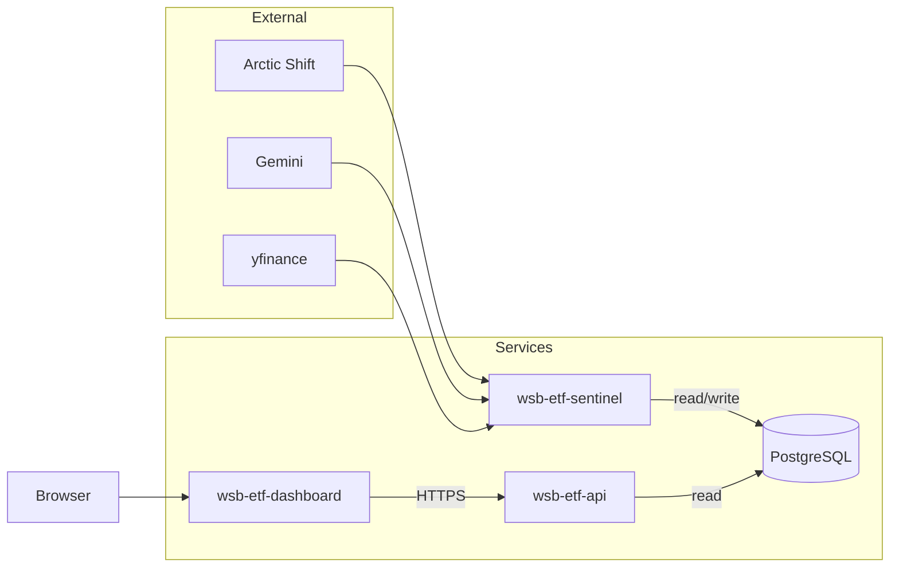

# WSB ETF

Synthetic ETF from [r/wallstreetbets](https://www.reddit.com/r/wallstreetbets/) discussion: Arctic Shift → Gemini (structured JSON) → Reddit score–weighted sentiment → basket weights and NAV (yfinance) → PostgreSQL. Weekly-style rebalance: full liquidation then repurchase at new weights. **Vite + React** dashboard backed by a JSON **API**. Services run in **Docker** with a shared database.

## Architecture



| Package | Role |
| ------- | ---- |
| **wsb-etf-sentinel** | **Two cron jobs** on the same image: (1) `python -m src.main` — full pipeline (Reddit → Gemini → rebalance → DB). (2) `python -m src.nav_tracker` — daily NAV only (prices current composition, upserts `etf_data_points`; no scrape or rebalance). |
| **wsb-etf-db** | Postgres: composition, NAV, changelog. |
| **wsb-etf-api** | JSON under `/api/*`, CORS for the dashboard. |
| **wsb-etf-dashboard** | SPA; `VITE_API_URL` baked in at build. |

## Database

Created in `wsb-etf-sentinel/src/db.py` (`ensure_tables`, baseline seed when empty). Tables: `etf_composition` (ticker, %, shares, price, date), `etf_data_points` (NAV per date), `etf_changelog` (added / removed / rebalanced). Details and constants (e.g. genesis row) live in `db.py`.

## API

| Method | Path | Notes |
| ------ | ---- | ----- |
| GET | `/api/health` | Liveness + DB |
| GET | `/api/composition` | Optional `?date=YYYY-MM-DD` |
| GET | `/api/price-history` | Optional `from` / `to` |
| GET | `/api/changelog` | Recent changes |

## Environment

**Sentinel:** `DATABASE_URL` (both jobs). `GEMINI_API_KEY` only for `src.main` (`nav_tracker` does not call Gemini).  
**API:** `DATABASE_URL`, optional `PORT`  
**Dashboard (build):** `VITE_API_URL` — public API base URL, no trailing path  

Use `.env.example` files in each package where present.

## Local dev

- Postgres + `DATABASE_URL` on sentinel and API.
- API: `cd wsb-etf-api && npm ci && npx tsx src/index.ts`
- Dashboard: `cd wsb-etf-dashboard && npm ci` — `.env` with `VITE_API_URL=http://localhost:3000` — `npm run dev`
- Sentinel: `cd wsb-etf-sentinel` — deps from `requirements.txt` / `pyproject.toml` — `python -m src.main` and/or `python -m src.nav_tracker`

## Deploy

1. Provision Postgres → `DATABASE_URL`.
2. **wsb-etf-api** — root `wsb-etf-api/`, Dockerfile, same `DATABASE_URL`.
3. **wsb-etf-sentinel** — root `wsb-etf-sentinel/`, Dockerfile, `DATABASE_URL` + `GEMINI_API_KEY`. **Two** cron triggers: **`python -m src.main`** (rebalance cadence) and **`python -m src.nav_tracker`** (e.g. daily NAV). Override the image `CMD` per trigger or run manually.
4. **wsb-etf-dashboard** — root `wsb-etf-dashboard/`, Dockerfile, build arg `VITE_API_URL` = public API URL.

## Repo layout

```
wsb-etf-api/        TypeScript HTTP API
wsb-etf-dashboard/  Vite + React (nginx in prod image)
wsb-etf-sentinel/   Python pipeline + Gemini + yfinance
```
